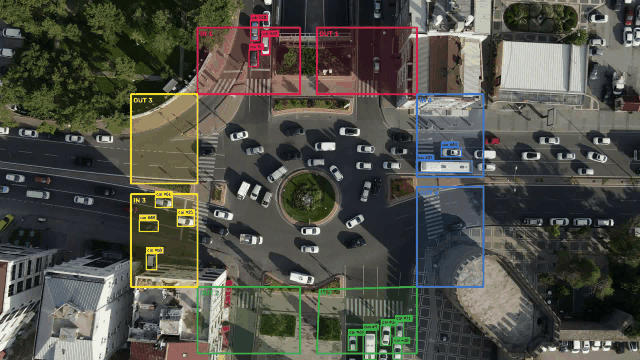

# Vehicle Detection and Direction Tracking

It detects and tracks vehicles in a traffic video with Ultralytics
YOLO and ByteTrack. Four pairs of colored `IN` and `OUT` zones represent the
four traffic directions.

A vehicle is hidden until its tracked center enters an `IN` zone. It is then
shown with a bounding box, ID label, and movement trail that match the color of
that entry zone.

## Demo

